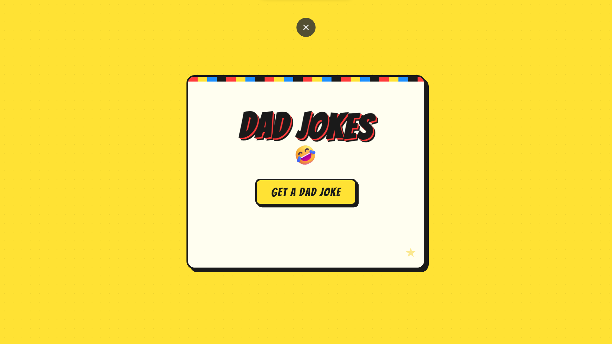

# 😂 Dad Jokes Generator

A simple, fun, and responsive web app that fetches random dad jokes using an API. One click = instant cringe humor.

---

## 🚀 Features

- 🎯 Fetch random dad jokes from API
- ⚡ Fast and lightweight
- 🎨 Modern, clean UI
- 📱 Fully responsive (mobile + desktop)
- 🔁 Smooth interaction on each click

---

## 🛠️ Tech Stack

- HTML
- CSS (Modern UI + Responsive Design)
- JavaScript (Fetch API)

---

## 📸 Screenshot



---

## 📦 Installation

```bash
git clone https://github.com/your-username/dad-jokes-generator.git
cd dad-jokes-generator
```
Then open index.html in your browser.

🔌 API Used
https://icanhazdadjoke.com/

💡 How It Works
Click the button
App sends request to API
Joke is displayed instantly

✨ Future Improvements
Dark mode 🌙
Joke categories
Save favorite jokes ❤️
Share button
🤝 Contributing

Pull requests are welcome. For major changes, open an issue first.

📄 License

This project is open source and available under the MIT License.

😄 Fun Fact

Dad jokes are scientifically proven to be 87% more funny when you're bored.
